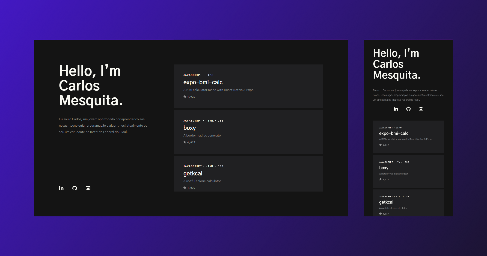

<div align="center">
  <h1>
    carlos3g.github.io
  </h1>
  <blockquote>
    My portfolio on github
  </blockquote>
  <div id="badges">
    
    
    
  </div>
</div>
    
## Table of contents

- [About the project](#-about-the-project)
  - [Screenshots](#-screenshots)
  - [Technologies](#-technologies)
  - [How to run](#-how-to-run)
- [How to contribute](#-how-to-contribute)
- [License](#-license)

## 💻 About the project

Portfolio made by me to show some of my projects and useful information to employers

### 📷 Screenshots

<div align="center">
  
</div>

### 🛠 Technologies

The following technologies were used in the construction of the project:

- [React](https://pt-br.reactjs.org)
- [Github Pages](https://pages.github.com)

### 🚀 How to run

1. Clone the repository

   ```bash
   git clone https://github.com/carlos3g/carlos3g.github.io.git
   ```

2. Install the dependencies

   ```bash
   cd carlos3g.github.io
   yarn install
   ```

3. Run the application
   ```bash
   yarn start
   ```

## 🤝 How to contribute

Every kind of contribution is welcome, we admire it!

Is there any problem? Found a bug? Do you have any tips? Open an [issue](https://github.com/carlos3g/carlos3g.github.io/issues) describing it.

Want to contribute code? We ask that you first read [this contribution guide](https://github.com/firstcontributions/first-contributions)

Don't forget to leave your ⭐, it is also a way to contribute to the project;)

## 📝 License

This project is under the MIT license. See the file [LICENSE](LICENSE) for more details.

---

<div align="center">

Created by [Carlos Mesquita](https://github.com/carlos3g) 💜

</div>
